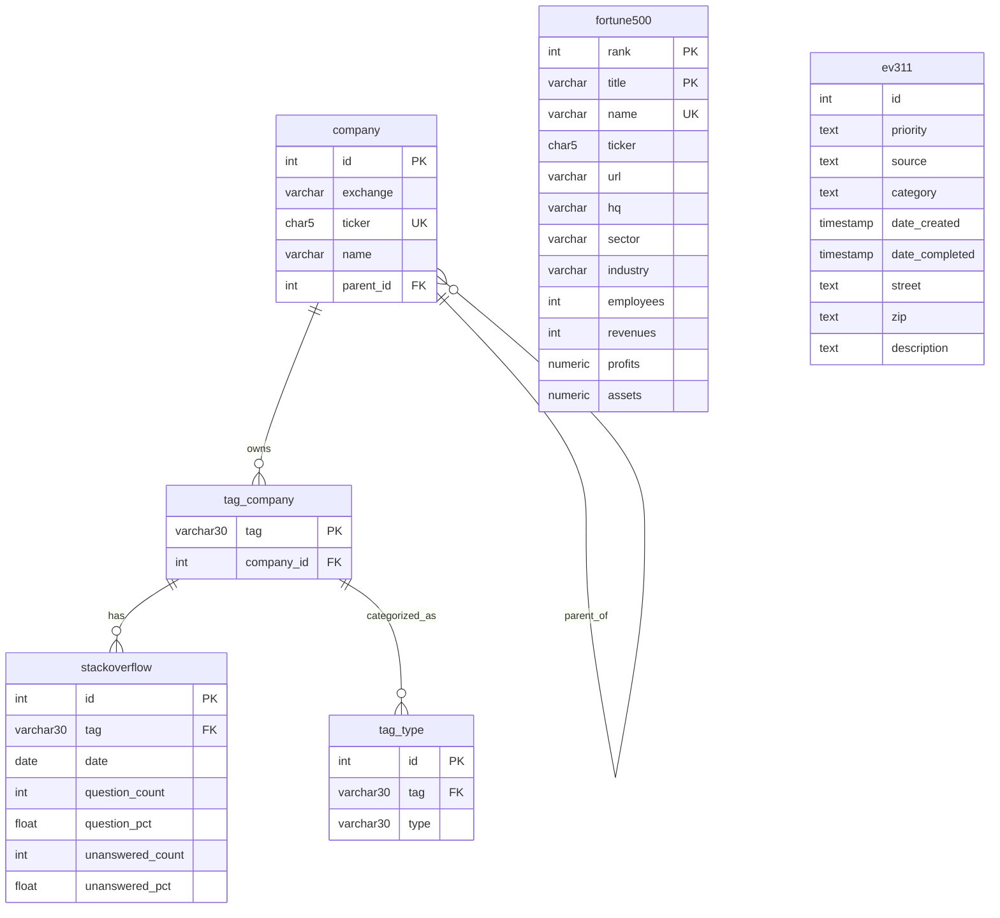

  >>+𝕿𝖗𝖆𝖈𝖎𝖓𝖌+𝕾𝖎𝖌𝖓𝖆𝖑+::+𝕺𝖗𝖎𝖌𝖎𝖓+➜+𝕹𝖆𝖎𝖗𝖔𝖇𝖎+•+𝕾𝖐𝖞𝖓𝖊𝖙+𝕯𝖆𝖙𝖆𝕲𝖗𝖎𝖉+𝕷𝖆𝖇𝖘;🛰️+>>>+𝕴𝖉𝖊𝖓𝖙𝖎𝖙𝖞+𝕮𝖔𝖓𝖋𝖎𝖗𝖒𝖊𝖉+::+6+𝕾𝖊𝖓𝖎𝖔𝖗+𝕯𝖆𝖙𝖆+𝕾𝖈𝖎𝖊𝖓𝖈𝖊+𝕾𝖙𝖚𝖉𝖊𝖓𝖙𝖘;🧠+[░░░░░░░░░░]+0%25+::+𝕭𝖔𝖔𝖙𝖎𝖓𝖌+𝕸𝕷+𝕴𝖓𝖋𝖗𝖆𝖘𝖙𝖗𝖚𝖈𝖙𝖚𝖗𝖊;⚙️+[███░░░░░░░]+30%25+::+𝕬𝖗𝖒𝖎𝖓𝖌+𝖃𝕲𝕭𝖔𝖔𝖘𝖙+•+𝕾𝖈𝖎𝖐𝖎𝖙-𝕷𝖊𝖆𝖗𝖓;🚀+[█████░░░░░]+50%25+::+𝕯𝖊𝖕𝖑𝖔𝖞𝖎𝖓𝖌+𝕱𝖆𝖘𝖙𝕬𝕻𝕴+•+𝕬𝖚𝖙𝖔+𝕽𝖊𝖙𝖗𝖆𝖎𝖓;👁️+[███████░░░]+70%25+::+𝖄𝕺𝕷𝕺𝖛11+•+𝕽𝖊𝖘𝕹𝖊𝖙152+•+94%25+𝖒𝕬𝕻;📊+[████████░░]+80%25+::+𝕻𝖔𝖜𝖊𝖗+𝕭𝕴+•+𝕿𝖆𝖇𝖑𝖊𝖆𝖚+•+6+𝖄𝖊𝖆𝖗𝖘+𝕺𝖋+𝕯𝖆𝖙𝖆;🗄️+[█████████░]+90%25+::+𝕿𝖊𝖈𝖍𝕻𝖚𝖑𝖘𝖊+𝕾𝕼𝕷+𝕮𝖔𝖗𝖊+•+12+𝕼𝖚𝖊𝖗𝖎𝖊𝖘;🤖+[██████████]+100%25+::+𝕸𝕷𝕺𝖕𝖘+•+𝕯𝖔𝖈𝖐𝖊𝖗+•+𝕮𝕴/𝕮𝕯+•+𝕷𝖎𝖛𝖊;✅+𝕬𝖑𝖑+𝕾𝖞𝖘𝖙𝖊𝖒𝖘+𝕹𝖔𝖒𝖎𝖓𝖆𝖑+•+𝕭𝖚𝖎𝖑𝖙+𝖂𝖎𝖙𝖍+𝕽𝖎𝖌𝖔𝖗;⚡+𝕾𝖐𝖞𝖓𝖊𝖙-𝕯𝖆𝖙𝖆𝕲𝖗𝖎𝖉-𝕷𝖆𝖇𝖘+𝕴𝖘+𝕺𝖓𝖑𝖎𝖓𝖊+⚡;•−•−•−•−•−•−•−•−•−•−•−•−•−" alt="Skynet DataGrid Labs Boot Sequence"/>

<pre align="center">

```mermaid
%%{init: {
  'theme': 'base',
  'themeVariables': {
    'background': '#0a0a0a',
    'primaryColor': '#00ff41',
    'primaryBorderColor': '#00ff41',
    'primaryTextColor': '#00ff41',
    'lineColor': '#00ff41',
    'secondaryColor': '#0d1f0d',
    'tertiaryColor': '#0a0a0a',
    'fontFamily': 'monospace',
    'fontSize': '14px',
    'mainBkg': '#0a0a0a',
    'nodeBorder': '#00ff41',
    'nodeTextColor': '#00ff41',
    'titleColor': '#00ff41',
    'edgeLabelBackground': '#0a0a0a',
    'clusterBkg': '#0a0a0a',
    'clusterBorder': '#00ff41',
    'clusterTextColor': '#00ff41'
  },
  'flowchart': { 'curve': 'basis' }
}}%%
graph TB
    classDef org fill:#00ff41,stroke:#00ff41,stroke-width:3px,color:#0a0a0a,font-weight:bold,font-family:monospace;
    classDef ml fill:#0d1f0d,stroke:#00ffff,stroke-width:2px,color:#00ffff,font-weight:bold,font-family:monospace;
    classDef cv fill:#0d1f0d,stroke:#bf00ff,stroke-width:2px,color:#bf00ff,font-weight:bold,font-family:monospace;
    classDef bi fill:#0d1f0d,stroke:#ff0080,stroke-width:2px,color:#ff0080,font-weight:bold,font-family:monospace;
    classDef data fill:#0d1f0d,stroke:#00ff41,stroke-width:2px,color:#00ff41,font-weight:bold,font-family:monospace;
    classDef collab fill:#0d1f0d,stroke:#4488ff,stroke-width:2px,color:#4488ff,font-weight:bold,font-family:monospace;
    classDef scrape fill:#0d1f0d,stroke:#ff8800,stroke-width:2px,color:#ff8800,font-weight:bold,font-family:monospace;
    classDef standard fill:#0d1f0d,stroke:#ffdd00,stroke-width:2px,color:#ffdd00,font-weight:bold,font-family:monospace;
    classDef output fill:#00ff41,stroke:#00ff41,stroke-width:3px,color:#0a0a0a,font-weight:bold,font-family:monospace;

    subgraph KEY["[ 0x00 ] LEGEND"]
        direction LR
        K1["ML"]:::ml ~~~ K2["CV"]:::cv ~~~ K3["BI"]:::bi ~~~ K4["Data"]:::data ~~~ K5["Collab"]:::collab ~~~ K6["Scraping"]:::scrape ~~~ K7["Standards"]:::standard
    end

    ORG["SKYNET-DATAGRID-LABS<br/>Senior-Year Data Science Cohort<br/>6 Collaborators"]:::org

    subgraph T1["[ 01 ] MACHINE LEARNING SYSTEMS"]
        C1["Customer Churn Prediction<br/>XGBoost - Scikit-learn - FastAPI"]:::ml
        C2["Drift Monitoring"]:::ml
        C3["Scheduled Retraining"]:::ml
        C1 --> C2 --> C3
    end

    subgraph T2["[ 02 ] COMPUTER VISION"]
        V1["YOLOv11 - ResNet152 - OpenCV"]:::cv
        V2["94% mAP - 30+ FPS"]:::cv
        V3["Edge Deployment"]:::cv
        V1 --> V2 --> V3
    end

    subgraph T3["[ 03 ] BUSINESS INTELLIGENCE"]
        B1["Sales Intelligence Dashboard<br/>Power BI - Tableau - DAX"]:::bi
        B2["Kenya Product Sales<br/>FMCG KPIs 2020-2023"]:::bi
        B3["Dashboard Templates"]:::bi
    end

    subgraph T4["[ 04 ] DATA ENGINEERING"]
        D1["TechPulse Analytics<br/>PostgreSQL - 12 SQL Queries"]:::data
        D2["Technology Health Scoring"]:::data
        D3["Enterprise Adoption Signals"]:::data
        D1 --> D2 --> D3
    end

    subgraph T5["[ 05 ] ENGINEERING PRACTICE"]
        G1["GitHub Collab Lab<br/>Branching - PR - Code Review"]:::collab
        G2["Merge Conflict Resolution"]:::collab
        G1 --> G2
    end

    subgraph T6["[ 06 ] WEB SCRAPING AND VISUALIZATION"]
        W1["Web Scraping with R<br/>rvest - tidyverse - plotly"]:::scrape
        W2["3D Terrain DEM<br/>Price vs Rating"]:::scrape
        W1 --> W2
    end

    subgraph STD["ENGINEERING STANDARDS"]
        direction LR
        S1["Feature Branch Workflow"]:::standard
        S2["Mandatory Code Review"]:::standard
        S3["CI/CD on Every Push"]:::standard
        S4["Docker Reproducibility"]:::standard
        S5["Drift and Perf Monitoring"]:::standard
    end

    RESULT["6 Production-Grade Repositories<br/>Real Pipelines - Real Deployments - Real Team Workflows"]:::output

    ORG ==> T1 & T2 & T3 & T4 & T5 & T6

    T1 -->|"applies"| STD
    T2 -->|"applies"| STD
    T3 -->|"applies"| STD
    T4 -->|"applies"| STD
    T5 -->|"defines"| STD
    T6 -->|"applies"| STD

    STD ==> RESULT
    C3 -.->|"contributes"| RESULT
    V3 -.->|"contributes"| RESULT
    B3 -.->|"contributes"| RESULT
    D3 -.->|"contributes"| RESULT
    G2 -.->|"contributes"| RESULT
    W2 -.->|"contributes"| RESULT

    style KEY fill:#0a0a0a,stroke:#00ff41,stroke-width:1px
    style T1 fill:#0a0a0a,stroke:#00ffff,stroke-width:2px
    style T2 fill:#0a0a0a,stroke:#bf00ff,stroke-width:2px
    style T3 fill:#0a0a0a,stroke:#ff0080,stroke-width:2px
    style T4 fill:#0a0a0a,stroke:#00ff41,stroke-width:2px
    style T5 fill:#0a0a0a,stroke:#4488ff,stroke-width:2px
    style T6 fill:#0a0a0a,stroke:#ff8800,stroke-width:2px
    style STD fill:#0a0a0a,stroke:#ffdd00,stroke-width:2px
```

███████╗██╗  ██╗██╗   ██╗███╗   ██╗███████╗████████╗
██╔════╝██║ ██╔╝╚██╗ ██╔╝████╗  ██║██╔════╝╚══██╔══╝
███████╗█████╔╝  ╚████╔╝ ██╔██╗ ██║█████╗     ██║   
╚════██║██╔═██╗   ╚██╔╝  ██║╚██╗██║██╔══╝     ██║   
███████║██║  ██╗   ██║   ██║ ╚████║███████╗   ██║   
╚══════╝╚═╝  ╚═╝   ╚═╝   ╚═╝  ╚═══╝╚══════╝   ╚═╝   
         D A T A G R I D   L A B S
</pre>

### *`Where data tells the story. We build the stage.`*

 

 

> **We are a student-led machine learning lab** — six senior data science students
> building production-grade ML systems end-to-end. Not tutorials. Not toy datasets.
> Real pipelines. Real deployments. Real team workflows.

 

---

## `01 · Technical Capabilities`

| Domain | Implementation | Production Metrics |
|:---|:---|:---|
| **ML Systems** | XGBoost, Scikit-learn, FastAPI | API deployment, drift monitoring, scheduled retraining |
| **MLOps** | GitHub Actions, Docker, CI/CD | Zero-touch pipelines, automated validation |
| **Computer Vision** | YOLOv11, ResNet152, OpenCV | 94% mAP, 30+ FPS, edge deployment ready |
| **Business Intelligence** | Power BI, Tableau, DAX | Executive dashboards, multi-year strategic synthesis |
| **Data Engineering** | PostgreSQL, SQL | 12-query analytical pipelines, technology scoring |

---

## `02 · Technology Stack`

**Machine Learning & Data**

`Python` `scikit-learn` `XGBoost` `Pandas` `NumPy` `OpenCV`

**MLOps & Infrastructure**

`Docker` `GitHub Actions` `FastAPI` `PostgreSQL`

**Business Intelligence**

`Power BI` `Tableau`

---

## `03 · Project Portfolio`

### `[01]` Customer Churn Prediction Pipeline

Stack: `MLOps` `GitHub Actions` `Scikit-learn` `XGBoost` `FastAPI`

Automated machine learning system for customer churn prediction. Implements complete MLOps lifecycle: data validation, feature engineering, parallel model training, REST API deployment, drift monitoring, and scheduled retraining.

  >>_LOADING_CHURN_CORE_·_XGBoost_+_Scikit-learn_+_FastAPI_·_DRIFT_MONITOR_ARMED_·_AUTO-RETRAIN_LOCKED_✓" alt="Churn Preview" />

  

| Repository | Description |
|:---|:---|
| [churn-odyssey-mlops](https://github.com/skynet-datagrid-labs/churn-odyssey-mlops) | Production MLOps pipeline |
| [churn-flagship-project](https://github.com/skynet-datagrid-labs/churn-flagship-project) | Core churn analysis system |
| [Customer-Churn-prediction](https://github.com/skynet-datagrid-labs/customer-churn-prediction) | Customer churn predictions |

 

### `[02]` Computer Vision System

Stack: `YOLOv11` `ResNet152` `OpenCV`

Real-time object detection engineered for edge deployment. Achieves 94% mean Average Precision at 30+ frames per second on standard GPU hardware.

  >>_ACTIVATING_VISION_CORE_·_YOLOv11_+_ResNet152_+_OpenCV_·_94%25_mAP_·_30+_FPS_·_EDGE_DEPLOYED_✓" alt="CV Preview" />

  

| Repository | Description |
|:---|:---|
| [COMPUTER-VISION](https://github.com/skynet-datagrid-labs/COMPUTER-VISION) | Real-time object detection system |

 

### `[03]` Sales Intelligence Dashboard

Stack: `Power BI` `Tableau` `DAX`

Business intelligence asset synthesizing six years of transactional data into executive-level strategic intelligence with real-time KPI monitoring and regional profitability analysis.

  >>_RENDERING_POWER_BI_LAYER_·_6_YEARS_OF_TRANSACTIONAL_DATA_·_EXECUTIVE_KPI_DASHBOARD_LIVE_✓" alt="Power BI Preview" />

**`Live Demos:`**

| Platform | Demo |
|:---|:---|
| Power BI |  |
| Tableau Visual 1|  |
| Tableau Visual 2 |  |
| Tableau Visual 3 |  | 
| Tableau Visual 4 |  |

| Repository | Description |
|:---|:---|
| [sales-intelligence-dashboard](https://github.com/skynet-datagrid-labs/sales-intelligence-dashboard) | Executive BI asset |
| [Kenya-Product-Sales](https://github.com/skynet-datagrid-labs/Kenya-Product-Sales) | Analyzing Kenyan FMCG sales KPIs by product, customer, and county from 2020–2023 |

  >>_DASHBOARD_TEMPLATES_NOW_AVAILABLE_·_PRODUCTION-GRADE_·_PLUG_%26_PLAY_·_GET_YOURS_TODAY_✓" alt="Templates Available" />

  <strong>📦 Professional Tableau Dashboard Templates — Built by the Lab</strong> 
  FMCG · Sales KPIs · Regional Analytics · Kenya-Ready Data Models

  

  🔴 Click the banner above to browse and download templates

---

 

### `[04]` TechPulse Analytics

Stack: `PostgreSQL` `SQL`

Analytical workspace with twelve reusable SQL queries synthesizing community activity, enterprise adoption patterns, and developer sentiment into technology health scores. A comprehensive PostgreSQL analytics platform that extracts actionable insights from StackOverflow developer activity, corporate technology ownership, and financial data — answering questions like which technologies are growing or dying, what makes a technology ecosystem healthy, how corporate structures affect developer engagement, and which companies have the strongest developer communities.

**Sample Output**

*Android leads with 962,919,007 questions, followed by ios and sql-server*

**Dataset Description**

The analysis uses six interconnected PostgreSQL tables from DataCamp public datasets:

| Table | Description | Key Fields |
|-------|-------------|------------|
| `company` | Corporate entities | id, name, ticker, parent_id |
| `stackoverflow` | Daily developer questions | tag, date, question_count, unanswered_pct |
| `tag_company` | Tech-to-company mapping | tag, company_id |
| `tag_type` | Technology categorization | tag, type (language/framework/database) |
| `fortune500` | Financial metrics | rank, name, revenues, profits, employees |
| `ev311` | Municipal service data | category, date_created, street, zip |

**Database Schema**

  

| Repository | Description |
|:---|:---|
| [TechPulse](https://github.com/skynet-datagrid-labs/TechPulse) | Technology health analytics |

 

### `[05]` GitHub Collab Lab

Stack: `Git` `Branching` `Pull Requests` `Code Review`

Mastery of professional engineering collaboration workflows including branching strategies, PR etiquette, code review cycles, and merge conflict resolution.

| Repository | Description |
|:---|:---|
| [github-collab-lab](https://github.com/skynet-datagrid-labs/-github-collab-lab) | Team workflow mastery |

---

## `04 · Engineering Standards`

| Practice | Standard |
|:---|:---|
| Version Control | Feature branch workflow, semantic commits |
| Code Review | Mandatory approvals (minimum two reviewers) |
| Testing | Unit tests, validation pipelines, evaluation suites |
| Documentation | README, docstrings, architecture diagrams |
| CI/CD | GitHub Actions on every push |
| Reproducibility | Docker, pinned requirements, environment locking |
| Monitoring | Drift detection, performance tracking, automated alerts |

---

### `[06]` Web Scraping with R — Terrain Visualization

Stack: `rvest` `tidyverse` `plotly` `viridis`

AI-console-driven scraping pipeline that turns BooksToScrape.com listings into an interactive 3D Digital Elevation Model — price and rating mapped to terrain, with peaks marking premium high-rated titles and valleys marking budget segments.

  >>_BOOTING_SKYNET_AI_CONSOLE_·_rvest_+_tidyverse_+_plotly_·_DEM_TERRAIN_ENGINE_ARMED_✓" alt="Web Scraping Preview" />

**`Live Demos:`**

| Demo | Preview |
|:---|:---|
| Full Pipeline Walkthrough |  |
| Interactive 3D Terrain Exploration |  |

**`System Snapshots:`**

| View | Screenshot |
|:---|:---|
| AI Console Boot |  |
| 3D Terrain Output |  |

| Repository | Description |
|:---|:---|
| [Web-Scraping-with-R](https://github.com/skynet-datagrid-labs/Web-Scraping-with-R) | rvest + plotly terrain visualization of book pricing vs. rating data |

 

----

## `07 · Contact`

| | |
|:---|:---|
| **Email** | [tonykenga23@gmail.com](mailto:tonykenga23@gmail.com) |
| **GitHub** | [github.com/skynet-datagrid-labs](https://github.com/skynet-datagrid-labs) |

---

  <em>Built with rigor. Deployed with intent. Documented with pride.</em>  
  <strong>SKYNET-DATAGRID-LABS</strong> — Senior-Year Data Science Cohort

